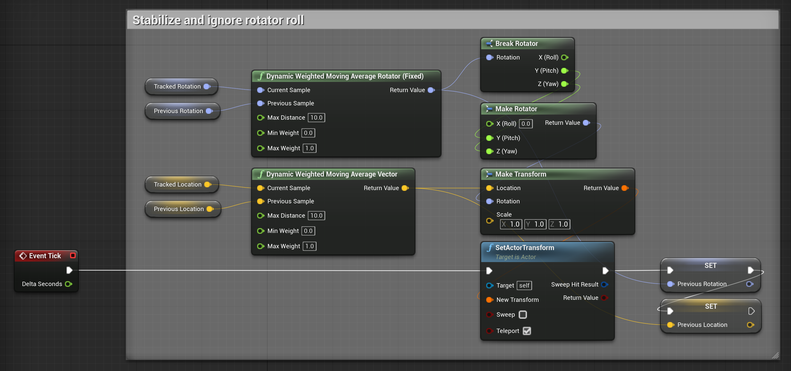

# weighted-moving-average-rotator
Fixed implementations of Unreal's "Weighted Moving Average Rotator" and "Dynamic Weighted Moving Average Rotator" blueprint functions that properly understand angles.

### The fix
Unreal's implementation incorrectly treats the samples as simple linear points on a number line. When the Previous and Current Samples cross the circular boundary at -180 / 180, Unreal glitches. The fix is simple: correctly calculate the angular distance between the Samples. -179 to 179 is a distance of two, for example.

### Example
This is from a project that updates an Actor with location and rotation data from an external controller. This external controller data is noisy, and needs to be stabilized to look good. The external controller component places the raw values into class variables named "Tracked Location" and "Tracked Rotation". On every tick I take those values, smooth them, and set the Actor's transform.

